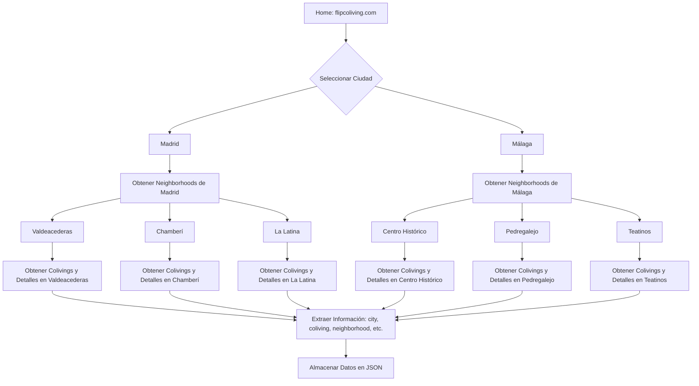

```mermaid
graph TD;
    A[Home: flipcoliving.com] --> B{Seleccionar Ciudad};
    
    B --> C[Madrid];
    B --> D[Málaga];
    
    C --> E[Obtener Neighborhoods de Madrid];
    D --> F[Obtener Neighborhoods de Málaga];

    E --> G1[Valdeacederas] & G2[Chamberí] & G3[La Latina];
    F --> H1[Centro Histórico] & H2[Pedregalejo] & H3[Teatinos];

    G1 --> I1[Obtener Colivings y Detalles en Valdeacederas];
    G2 --> I2[Obtener Colivings y Detalles en Chamberí];
    G3 --> I3[Obtener Colivings y Detalles en La Latina];
    
    H1 --> J1[Obtener Colivings y Detalles en Centro Histórico];
    H2 --> J2[Obtener Colivings y Detalles en Pedregalejo];
    H3 --> J3[Obtener Colivings y Detalles en Teatinos];

    I1 --> K[Extraer Información: city, coliving, neighborhood, etc.];
    I2 --> K;
    I3 --> K;
    J1 --> K;
    J2 --> K;
    J3 --> K;

    K --> L[Almacenar Datos en JSON];

```